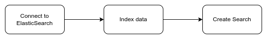

# BOE-FOAF

Repository for GESTBD hackathon. The initial idea of this project is to fetch or scrap data from [BOE page](https://www.boe.es/index.php) to create a tool with which you can use for thses things:

1. Analysis of changes and updates in laws and regulations.
2. Identification of legal trends from historical BOE data.
3. Development of tools for the efficient management and search of legal information.

## Workflow

The following workflow represents the usage of this application. It is devided on three main blocks, the first one is the gathering of information, with this we generate the data on json format to use [OpenRefine](https://openrefine.org/) software in order to connect via Ontologies and thus combine with information from other pages like [DBpedia](https://es.dbpedia.org/) in order to gather more information. The last step is to expose this information to a better search for the user.

Steps:

1. Use `python __init__.py` to generate **graph knowledge** and **jsons** that can be uploaded to mongodb.
2. Open **Graphdb** to see the knowledge graph uploading the `.ttl` file.
3. Use **Elastik Search** and upload **json** files to generate queries.

### Gather information

The basic part of this step is the gathering of data from [BOE page](https://www.boe.es/index.php). To fulfill this firstly a connection is created to the web via this [URL](https://boe.es/diario_boe/xml.php?id=BOE-S). Once connected the next step is to download the bulletin which contains information about the resolutions of the *DD/MM/YYYY*. Once the bulletin is downloaded, all the metadata and other information about it is recollected and expressed on several jsons:

- JSON about *"Sumarios"*. *Sumarios* is the information about *bulletins*. The *Sumarios* have the following information:
  - Metadata
  - SumarioID
- JSON about *"Items"*. Each of this *"Items"* has the resolutions of the different tematics.
  - Metadata
  - SummarioID
  - ItemID
- JSON about *"Articulos"*. Contains information about the article which is published.
  - Information about article
  - ItemID

### Ontology

In order to create a knowledge graph where any information can be gathered, about any specific data. [OpenRefine](https://openrefine.org/) helps with this task, even though in this case it is used manually, the process is very simple. Once the json files have been uploaded, the first step is to select the column which we want to gather more information.

On the other hand, [OpenRefine](https://openrefine.org/) has not been fully useful for this part of the project since there were errors when using it and merging with [dbpedia](https://es.dbpedia.org/) knowledge graph. So another aproach was taken, using **rdflib** to generate the knowledge graph using the [ontology](./ontology/boe.owl). This process is very useful to then use [graphdb](https://www.ontotext.com/products/graphdb/) and show the knowledge graph. Although there is a drawback because in this case there is no connection with other ontologies, but nevertheless it can be done as a future advancement.

With the knowledge graph, a `.ttl` file is generated which represents it.

### Elastic

Elasticsearch is a **NoSQL** technology that alows to store, search and analyze data. The way data is inserted is via **indexation**, this engine is made based on Apache. It can be scale out horizontally or vertically. Use the [notebook](./elastic.ipynb) to see all that can be done.

There are more things that can be done with this database, and one is the **semantic search**, which we encourage readers to try and get it done.

